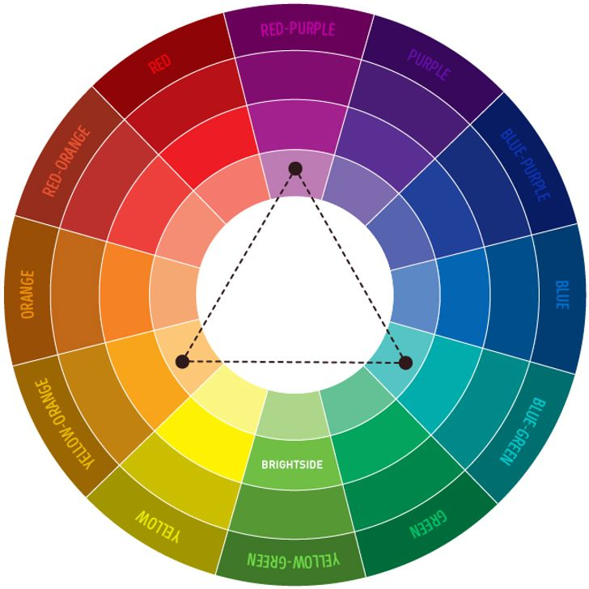
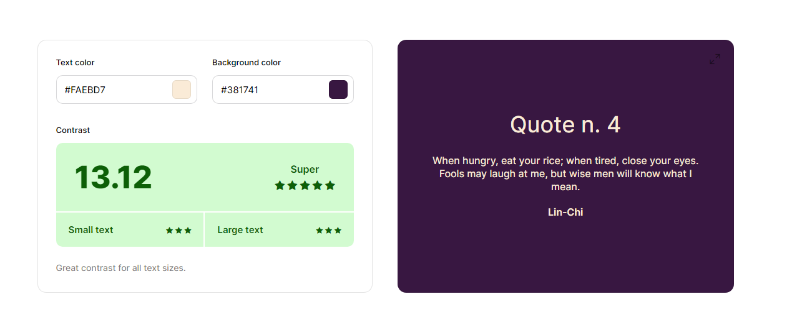
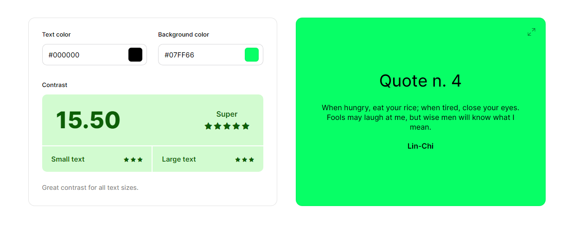
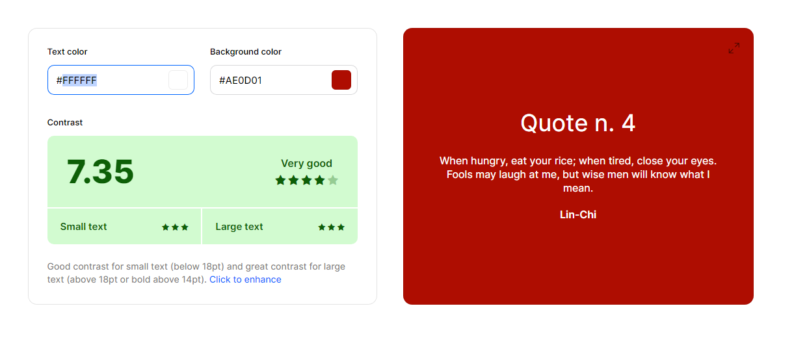
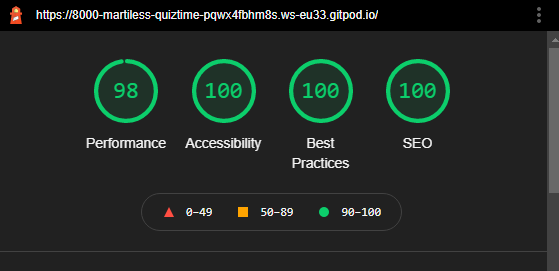

# Quiz Time 

This website has been created as the second Milestone project for Code Institute's Full Stack Software Development Diploma. It was built using HTML, CSS and JavaScript. GitPod was used for writing the code for this website, as well as committing and pushing to GitHub. GitHub was then used to store the project after it had been pushed from GitPod. Once all the code had been written, GitPages was then used to deploy the website. 

This website is a fun and easy to play Movies & TV Shows quiz game.
It was designed to allow users to take 5 minutes out of their day to unwind and have a bit of fun. 

### View the live website [here](https://martiless.github.io/quiz-time/)
***

***

## Table of content: 
 1. [Site Goals](#Site-Goals)
 1. [UX](#UX)
      1. [User Stories](#User-Stories)
      1. [Development Planes](#Development-Planes)
            * [Strategy](#Strategy)
            * [Scope](#Scope)
            * [Structure](#Structure)
            * [Skeleton](#Skeleton)
            * [Surface](#Surface)
      1. [Color](#Color)
      1. [Font](#Font)
      1. [Images](#Images)
 1. [Features](#Features)
      1. [General](#General)
      1. [Home page](#Home-page)
      1. [Questions](#Questions)
      1. [Score](#Score)
      1. [Leader Board](#Leader-Board)
 1. [Testing](#Testing)
 1. [User Stories Met](#User-Stories-Met)
 1. [Bugs](#Bugs)
 1. [Technologies Used](#Technologies-Used)
 1. [Validation](#Validation)
 1. [Accessibility](#Accessibility)
 1. [Deployment](#Deployment)
 1. [Credits](#Credits)
      1. [Content](#Content)
      1. [Media](#Media)
      1. [Code](#Code)
***
  

## Site Goals:

The goals for this site are as follows:
* To provide users with a fun interactive game.
* To test the users knowledge of popular Movies and TV Shows.

## UX:

### User stories:
#### New User:  
* As a new user, I am looking to find play an online game that tests my knowledge of popular Movies and TV Shows.  
* As a new user, I would like to keep trace of my score as I progress through the quiz.  
* As a new user, I would like to get live feedback of my answers.   

#### Returning User:
* As a returning user, I would like to check if there has been any new questions added.
* As a returning user, I would like to see if there has been any new categories added.
* As a returning user, I would like to attempt to beat my previous score.
* As a returning user, I would like to see a leader board of the top 10 scorers.

## Development Planes:
To create a website that is comprehensive and informative for a user, as a developer you need to look at all aspects of the website and how someone who visits your website will use it. You have to consider all the user stories that have been outlined in the above sections.  

## Strategy
The strategy principal looks at user needs, as well product/service objectives. This websites target audience was broken down into three categories:
### Roles: 
* New User
* Existing User  

### Demographic:
*   People aged between 16 & 55 years

### Psychographic:
#### Lifestyle:
*   People who have a keen interest in movies and TV shows
 

#### The website needs to allow users to:  
* Easily enter a username   
* Get live feedback of if the answer is correct or incorrect 
* See the correct answer if they answered incorrect  
* See a running total of their score
* Provide a top 10 scorers board when the quiz has been completed  

#### The website needs to allow the developer to:  
* Keep track of all usernames being added so no name is used more than once   
* Keep track of all scores that will be displayed on the top 10 scorers board  

## Scope:  

With the structure in place, it was then time to move onto the scope plane. This was all about developing website requirements based on the goals set out in the strategy plane. These requirements are broken down into two categories. 

### Content Requirements:
1. The user will be looking for:
      * Receive instant feedback on if their answer selection is correct or not

### Functionality Requirements:
1. The user will be able to:
      * Add a username at the end of the game. 

## Skeleton:
[Wireframes](documents/WIREFRAME.md "Link to Wireframe screenshots") were created to set out the initial appearance of the website while also making sure to keep the end-user in mind at all times. Wireframes were created using [Balsamiq](https://balsamiq.com/).  

## Surface:
[Please see the live site here](https://martiless.github.io/quiz-time/)

### Color: 
To create a visually appealing website but also a website that was easy for people to read I used several different sites to test color contrast. I wanted to make sure the color scheme was not only eye-catching but also that it passed the LightHouse Accessibility test. 

Initially, I looked at what colors work best with the color I had chosen for the buttons. I did this by using a color wheel.  

Following on from the color wheel, I decided to use a purple color for the buttons with a cream color as the color when a user hoover over any of the buttons. For the correct and incorrect answer color change I went with your standard red and green. I ran all these color decisions through a color contrast checker to make sure that they would be easy to read for any user. 

Color Checker 1

Color Checker 2

Color Checker 3

### Font:
The font pairing for this website was Marvel which I imported from [Google Fonts](https://fonts.google.com/). I used a backup font family of Sans-Serif in case there were any issues with the imported fonts

 

### Imagery:

The imagery on this site was sourced from [Pexel](https://www.pexels.com/)

I wanted the user to instantly know that they were on a site that had a movie/TV show theme to it. For this reason I decided to use a cinema screen as the backgound image for the quiz. 

***
[Back to top](#Quiz-Time)  
  

## Features:
There are several features on this site to help users get the most out of their visit to the site.  

### Home Page:
When a user comes to the site the first thing they will see is a large button with the text "Let's start the game" Once the users clicks on this button the questions will begin to load.
[Home Page](documents/images/landing_page.PNG)

### Questions:
Once the game has started a total of 10 questions will be asked. The user will get a choice of 4 answers and can keep track of both the number of questions and their score at the bottom of the screen.
[Questions and Scoring area](documents/images/questions_score.PNG)

### Answered Question:
When the user picks an answer they will receive instant feedback as to it their answer is correct or not. This will happen in the form of the answer buttons changing color and the score tracker incrementing if the answser selected is correct.
[Answered Questions](documents/images/question_answered.PNG)

### Restart Game:
After all 10 questions have been asked, the user has the option to enter a username and restart or just simply restart the game without providing a username.
[Restart Game](documents/images/restart_username.PNG)

## Future Features:
* Leader Board: Initally I wanted a leaderboard to pop up at the end of the game when the user entered a username to show the top ten scorers of the game. This table would have been populated by data that had been stored in a JavaScript file. However, with time restictions, it was decided that this element of the game, for now, would not be included.

***
[Back to top](#Quiz-Time)  

## User Stories Met:
This section is to look back at the User stories we established during the strategy phase of the project. 
We are looking to see if we have met all the goals we set out. 
#### New User:  
* 
***

## Testing:
Testing information can be viewed [here](documents/TESTING.md "Link to testing information")

***

## Bugs:
1. Hiding all elements of the quiz at the start of the game.
      1. This was achieved by removing elements of the css code that was over writting the class of 'hidden' 
1. Getting the answers selection to appear in the quiz once the start button was clicked by the used. 
      1. After a lot of time going over the code, using Google Dev Tools and Jshint to see if there were any errors I got intouch with the Code Institute tutors who helped me see that I was using an element within the function that was not intended to be used in this function. Once I corrected this error the code worked exactly how it should have. 
1. Linking the JSON file to the JavaScript file in order to input the questions and the lead-board names
      1. My inital way of getting around this was to input all the relevant information at the bottom of the JavaScript file. However after speaking to my mentor it was decided that the best way was to create a new JS file and import the script above the script.js file in the HTML. 
1. Getting the users score to only increase when the correct answer was selected.
      1. This was something that I found very difficult as the score was increasing when the user clicked on any button. After a lot of time trying to figure this out I put my issue up on Slack and asked the community of students to help me. It turned out that I had accidentally used the userScore function somewhere else that was over writing the code I wanted it to use. Once I removed this line of code that was not needed the score tracker worked correctly. 
1. The alter that comes up when a user submits a username was not appearing, but was when you reload the page.
      1. When originally creating the event listener for the submit button I had incorrectly written the inner function without stating that it was a function, i.e I wrote the event followed by a string without telling the code what to do with the string. After spending time looking at the code and trying to figure out what was going wrong, I took some time away from the code and came back with fresh eyes at which point I had noticed my error.

### Unfixed Bugs:
1. The next button will continue to increase the questions if you do not answer a question but keep clicking the next button
      1. Due to time restrants I was unable to resolve this bug.

***
[Back to top](#Quiz-Time) 

## Technologies Used:
For the purpose of this project, the following technologies were used.  

### Languages:
* JavaScript
* JSON - I was going to use JSON to create the questions for the quiz and the leadboard that I would like to appear at the end of the game. However, after my intial research into learing about JSON, I decied with the time frame available to me it would have taken up too much time to learn. Therefore the questions were done using a questions.js file and the leadboard was put into a future features sections. 
* HTML
* CSS 

### Frameworks, Libraries, Programs & Applications Used:

#### Google Font
* Google fonts were used to import the Marvel font to the site. This was imported to style.css and was used throughout the project.

#### Font Awesome
*   Font Awesome was used to provide icons at various stages of the site for UX purposes.

#### GitPod
* GitPod was used for writing all the code for this project. It was also used to commit and push to GitHub.  

#### GitHub 
* GitHub was used to store this project.

#### GitPages
* GitPages was used to deploy the project.

#### Balsamiq 
* Balsamiq was used to draw initial Wireframes for this project.

#### Am I Responsive
* Am I Responsive was used to check that each page of the site was responsive. It was also used to create the mock-up image seen at the beginning of this document. 

#### Google Development Tools
* Google Dev Tools was used to edit code and check responsiveness before making the changes permanent.

*** 
[Back to top](#Quiz-Time)

## Validation:

See screenshot to W3C validator and Jigsaw CSS validator [here](documents/VALIDATION.md "Link to validation screenshots")

### **Index.html:**
No errors found. 

### **Style.css:**
No errors found

### **script.js:**
No errors found 

### **questions.js:**
No errors found 

***
[Back to top](#Quiz-Time)

## Accessibility:
To check the accessibily of this site I ran a Lighthouse report using Google Dev Tools 

LightHouse Report

***
## Deployment:
This project was developed using [GitPod](https://gitpod.io/), committed and pushed to [GitHub](https://github.com/) using a GitPod terminal.

Deploying on GitHub Pages
To deploy this page to GitHub Pages from its GitHub repository, the following steps were taken:

1. Log into GitHub.
1. Locate the GitHub Repository you are using.
1. At the top of the repository, select Settings from the menu items.
1. Scroll down the Settings page to the "GitHub Pages" section.
1. Click on the link provided. To open a new tab, right click on your mouse and select open in a new tab.
1. Under "Source" click the drop-down menu labelled "None" and select "Main". Once this is done click on "save"
1. Once you have clicked save, the page will automatically refresh. You will now get a link to the deployed website.
1. Copy this link and off you go. 

***
## Credits:

### Content:

1. 

### Media:

1. 

### Code:

1. 
*** 
[Back to top](#Quiz-Time) 